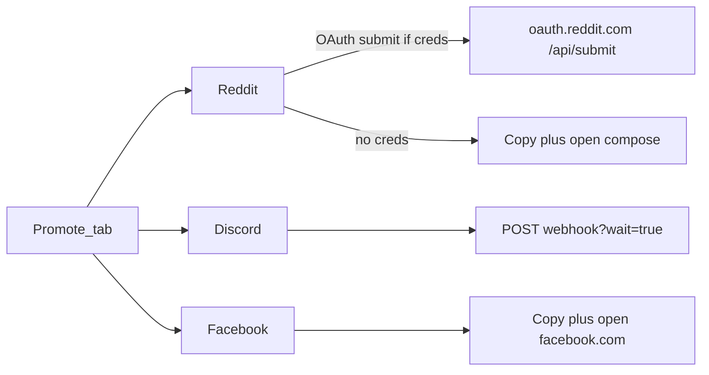

# Admin Promote tab (LFG)

## What exists today

Admin is a single page: [admin.html](admin.html) (yes emails + session links), gated by `ADMIN_PASSWORD` and `sessionStorage.ambaAdminToken`. [server.js](server.js) already talks to Discord’s **read-only** guild widget (`discordGuildId` `1534196054944121074`). There is no posting stack and no public site URL env var.

Signup CTA in every template: `{origin}/` plus UTM (`utm_source=reddit|discord|facebook`, `utm_medium=promote`, `utm_campaign=lfg`). Optional `PUBLIC_SITE_URL` in `.env` so server-side posts use the real host, not `localhost`.

## API reality (this drives the three “push” behaviors)

- **Discord (you chose webhook URL):** Incoming webhooks can create, edit, and delete their own messages. Send with `?wait=true`, store `message.id`, then `PATCH`/`DELETE` `/webhooks/{id}/{token}/messages/{message.id}`. No bot required. You paste the webhook for whatever LFG channel you control.
- **Reddit:** Official write path is still `POST https://oauth.reddit.com/api/submit` (self post: `kind=self`, `sr`, `title`, `text`, `api_type=json`), then `/api/edit` and `/api/del` with the `t3_…` fullname. That needs a **script** app + refresh/password grant (`submit`, `edit`, `identity`). New Reddit app registration is gated as of late 2025; if `.env` has credentials, push live; if not, same copy + open as Facebook (`https://www.reddit.com/r/{sub}/submit`). Default subreddit: `lfg` (editable). Default title style matching r/lfg: `[Online] [PF2e] [Weeknight] looking for 3–4 players — AMBA / WG / Owlbear test table`.
- **Facebook (you chose copy + open):** Graph API **cannot** post to LFG groups (`publish_to_groups` removed with Groups API, Graph v19, 2024). The tab fills the Facebook template, copies it, and opens Facebook so you paste into a group. After you post, you can paste the permalink into the ledger for tracking. No group automation.

Do not scrape or drive Facebook/Reddit in a headless browser.

## UI

Turn [admin.html](admin.html) into two tabs (same page, no new HTML file): **Yes emails** | **Promote**. Login button copy in [header.js](header.js) can stay “Open yes list”; landing tab remains Yes emails.

Promote layout:

1. **Signup link preview** — origin or `PUBLIC_SITE_URL`, with UTMs, Discord invite from existing Join URL (`https://discord.com/channels/1534196054944121074/`).
2. **Three template editors** (one card each). Defaults in [data/promote.json](data/promote.json); Save templates (admin API). Placeholders: `{{signupUrl}}`, `{{discordInvite}}`, `{{when}}` (leading yes slot from existing `adminYesMail` / `leadingYesSlot`).
3. **Compose + post**
   - Reddit: subreddit field, title, body; **Post** (API) or **Copy and open Reddit**.
   - Discord: webhook URL field (saved locally in `promote.json` settings, not shown in git if we keep secrets in `.env` as `DISCORD_LFG_WEBHOOK` with UI override); preview embed optional; **Post to Discord**.
   - Facebook: body only; **Copy and open Facebook**.
4. **Manage posts** table: platform, destination, status (`live` / `copied` / `edited` / `deleted` / `filled`), created time, permalink, actions: Edit (Discord/Reddit API), Delete remote, Mark filled, Forget row.

Match existing admin styles in [styles.css](styles.css) (`email-row`, `button`, `form-note`).

## Server ([server.js](server.js))

Add `jsonFiles.promote` → `data/promote.json`. Shape:

- `templates: { reddit: { title, body }, discord: { body }, facebook: { body } }`
- `settings: { redditSubreddit, discordWebhookUrl optional if not only in env }`
- `posts: [{ id, platform, status, destination, title, body, permalink, remoteId, createdAt, updatedAt }]`

Admin-auth endpoints (same Bearer token as yes-emails):

- `GET /api/admin/promote` — templates, settings (webhook URL redacted except last 6 chars), posts, resolved `signupUrl`
- `PUT /api/admin/promote/templates`
- `POST /api/admin/promote/post` — `{ platform: reddit|discord|facebook, title?, body, subreddit?, webhookUrl? }`
  - discord → webhook, persist `remoteId`
  - reddit → OAuth submit or `{ mode: "copy" }` so the client copies/opens
  - facebook → `{ mode: "copy", openUrl: "https://www.facebook.com/" }`
- `PATCH /api/admin/promote/posts/:id` — edit remote if possible; always update ledger
- `DELETE /api/admin/promote/posts/:id` — remote delete then mark `deleted` (or ledger-only if copy path)
- `POST /api/admin/promote/posts/:id/permalink` — attach Facebook/Reddit URL after a manual post

Reddit helper (no extra npm package): `https://www.reddit.com/api/v1/access_token` with HTTP Basic client id/secret, then submit. User-Agent from `REDDIT_USER_AGENT` (Reddit requires a unique UA). Persist rate-limit errors in the UI note.

Env (document in a short comment at the top of the promote helpers, not a new markdown file):

- `PUBLIC_SITE_URL`
- `DISCORD_LFG_WEBHOOK` (optional default)
- `REDDIT_CLIENT_ID`, `REDDIT_CLIENT_SECRET`, `REDDIT_USERNAME`, `REDDIT_PASSWORD`, `REDDIT_USER_AGENT`

`.env` stays uncommitted.

## Templates (starter copy)

Shared facts: Pathfinder 2e, online, AMBA + Wanderer’s Guide + Owlbear, Discord voice, **sign up on this site** (not AMBA login). Three platform-specific voices:

- **Reddit:** r/lfg-style tags in the title; markdown body; signup link on its own line.
- **Discord:** short + one link; optional embed title “Looking for players”.
- **Facebook:** no markdown; casual group-post tone; signup URL in plain text.

## Out of scope

Facebook Page Graph API, posting into other people’s Discord servers without a webhook, Reddit scraping, scheduling/cron, analytics beyond UTMs.
