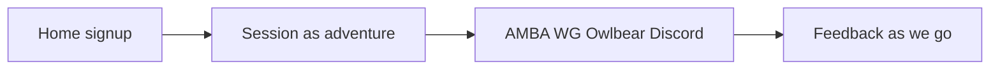

# An AMBA Adventure — friendlier site copy

**Brand:** **An AMBA Adventure** (your pick). Header mark: `AMBA Adventure`. Page titles: `Videos | An AMBA Adventure`, etc.

**Voice:** We are learning the tools **by playing a short adventure together**. Technical how-tos stay (public character, join key, uploads). Drop lab language: “workflow test,” “Join the test,” “stop when the procedure is proven,” “do not start a real adventure,” “disposable test characters,” “the point of the test.”

**Feedback:** Invite notes **as we go** (Discord + [feedback.html](feedback.html)), not a pre-session test plan or a pass/fail schedule. Signup grid stays as “when can you sit down,” not a strict test calendar.

Internal IDs (`#joinTest`, `amba-auth`, calendar UID) stay. Repo/video URLs stay.

## Copy on every public page

| Surface | Change |
|---|---|
| [header.js](header.js) | Brand `AMBA Adventure`. Profile options: “two characters ready” / “one character” / “still making them” / “not sure yet.” |
| [index.html](index.html) | Title + meta. Eyebrow like “A short adventure.” H1 like “We’re learning AMBA together.” Short lede: AMBA + Owlbear + new WG UI + combat, via one adventure. Button: **Join in**. Scheduler: “when you’re free,” not “time coordination.” |
| [session.html](session.html) | Biggest rewrite. Lede: this *is* the adventure vehicle, not “do not start a real adventure.” Intro: trusted group, same jobs as Pathbuilder/Foundry, **we’ll collect notes as we go**. Keep steps 1–10 as a **loose order**, not a protocol. Soften “checkpoint / procedure.” Step 10: jot what felt rough whenever, not only at the end. Module example name: not `workflow-test`. |
| [amba.html](amba.html) | Same facts. Close “what we are trying to learn” as curiosity + leave a note, not a test matrix. |
| [wg.html](wg.html) | “Two characters” not “disposable test PCs.” Last section: if the Party bench is empty, say so and keep playing (hand tokens if needed). |
| [owlbear.html](owlbear.html) | Room example not “AMBA workflow.” Last heading: “what to notice,” not “what this test is checking.” |
| [upload.html](upload.html) | Two public character JSON files for the table. |
| [videos.html](videos.html) | “A short look at the site and tools.” Title case on the video heading. File URL unchanged. |
| [discord.html](discord.html) | Title suffix only; lede can mention voice for the adventure. |
| [feedback.html](feedback.html) | “Drop a note anytime” / during or after. Topics: what confused you, what to screenshot later. Placeholder: “What felt unclear or delightful?” |
| [admin.html](admin.html) | Title suffix only. |
| [src/scheduler.jsx](src/scheduler.jsx) | Calendar description: `An AMBA Adventure` instead of `AMBA workflow test`. Rebuild `grid/scheduler.js` as you already do for scheduler edits. |

Keep examples (Merry-Anchor, four of eight, Party bench vs Characters). Do not expand pages with extra process.

## After copy

Quick pass in the browser: home CTA, header brand, Session lede, Feedback heading, one tool page. Confirm login still opens from **Join in**.
