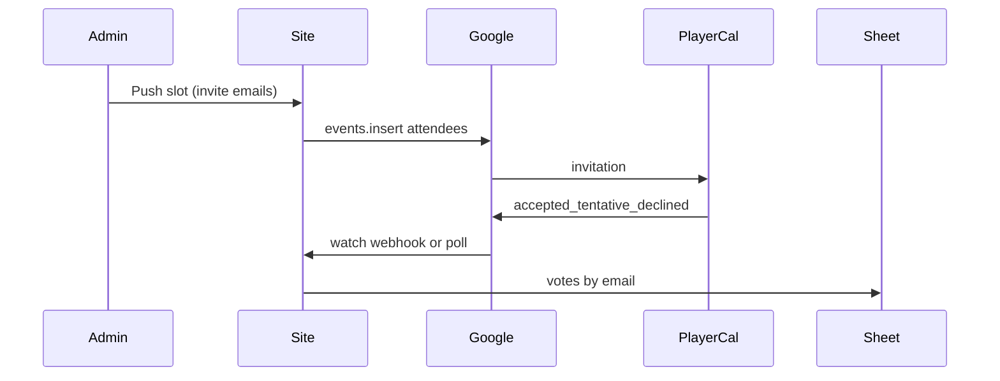

# Calendar RSVP → signup sheet

Google Calendar cannot tell this site about Yes / Maybe / No unless **we own the event and send invitations**. Today [src/scheduler.jsx](src/scheduler.jsx) opens a **TEMPLATE** (player’s own copy) or a **METHOD:PUBLISH** `.ics` with no `ATTENDEE`s. Those copies never report RSVPs back.

Players still **only log in by email**. Calendar identity is that same address. No Google login for players.

## Recommended organizer (simplest)

**GM signs in with Google once in Admin** (OAuth, `calendar.events` + offline refresh token). Events live on the GM calendar. Invites go to player emails. A Google service account cannot reliably invite personal Gmail/iCloud users without Workspace domain-wide delegation.

Store the refresh token server-side (env or a private admin JSON file, never client JS). Optional later: a dedicated “table calendar” Google account if you do not want the GM’s personal calendar.

## Phase 1 — Google Calendar

**Push (replace TEMPLATE for “the event we push”)**

- Admin (or a “Push this slot to calendars” action) creates/updates one Google event per schedule row.
- Persist on the time row: `googleEventId`, `googleCalendarId`, `icalUid` (stable, e.g. `{time.id}@amba-test.unwhelm.online`).
- `attendees`: emails of people who already have a signup (or a chosen list). Set `sendUpdates: "all"`.
- `guestsCanSeeOtherGuests: false`, `guestsCanInviteOthers: false` so BCC-style privacy stays close to the yes-email flow.
- Event title/description stay as now (adventure title, player packet = syndication URL, signup = site origin).

Keep “Save to Google Calendar” TEMPLATE as a **personal reminder** only, or hide it once push exists so people are not maintaining a second copy.

**RSVP → votes**

Map Google `responseStatus`:

| Calendar | Sheet |
| accepted | yes |
| tentative | maybe |
| declined | no |
| needsAction | leave vote unchanged (or clear) |

Match `attendee.email` with `normalizeEmail` to [upsertAdventureSignup](server.js) / `saveAvailability` (`votes[timeId]`). If they RSVP before logging in, **create user + signup from that email** (same as email-only identity).

**How we hear about changes**

1. Register `calendar.events.watch` to `POST /api/calendar/google-push` (verify channel token).
2. On notify, `events.list` with `syncToken` (or `events.get` for the known id).
3. Fallback: poll every few minutes if the watch channel expires (Google watches last ~1–7 days; renew on a timer).

Ignore RSVPs from the organizer’s own email unless they also have a signup.

**Conflict rule:** last write wins. Tag `votesSource[timeId] = "calendar"` vs `"site"` for debugging. Site Yes/No/Maybe still writes the sheet; optionally later we PATCH the Google attendee status so the calendar matches.

## Phase 2 — Apple Calendar / iCal

Do **not** build CalDAV in phase 1. Apple Calendar already RSVPs Google invitations for iCloud/Gmail attendees; those still hit the Google webhook.

Phase 2 covers **native iTIP** (Apple Mail / Calendar “Accept” sending `METHOD:REPLY`):

- When pushing, also email `METHOD:REQUEST` `.ics` (`ORGANIZER`, `ATTENDEE;RSVP=TRUE;PARTSTAT=NEEDS-ACTION`, same `UID` as `icalUid`).
- Inbound mailbox (SendGrid Inbound Parse, or similar) on something like `rsvp@…` → `POST /api/calendar/itip`.
- Parse `VEVENT` `UID` + `ATTENDEE` `PARTSTAT` (`ACCEPTED` / `TENTATIVE` / `DECLINED`) + attendee email → same vote mapper as Google.

Reuse the Google event UID so the same slot updates whether the reply came from Google or Apple.

## What not to do

- Do not expect TEMPLATE or PUBLISH `.ics` to notify the site.
- Do not require players to OAuth Google.
- Do not show the full attendee list on the invite.

## Files / surfaces

- [server.js](server.js): OAuth token helpers, create/patch event, watch + webhook, iTIP parser (phase 2), vote apply by email.
- Admin UI ([admin.html](admin.html)): Connect Google, Push slot, attendee list = signup emails.
- [src/scheduler.jsx](src/scheduler.jsx): optional label that the pushed event is the source of truth; rebuild `grid/scheduler.js`.
- Env: `GOOGLE_CLIENT_ID`, `GOOGLE_CLIENT_SECRET`, `GOOGLE_REDIRECT_URI`, `PUBLIC_SITE_URL`, later inbound mail secret.

## Test plan

- GM connects Google; push one slot; invite a test Gmail; Accept / Maybe / Decline in Google Calendar; sheet row updates without logging into the site.
- Change vote on the site; confirm it does not crash if Google PATCH is not built yet.
- Phase 2: Accept from Apple Calendar on an iCloud invite; inbound REPLY updates the same `time.id`.
