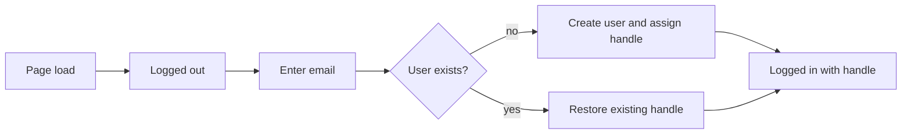

# Email login, then handle

## Current behavior

- [site.js](site.js) restores identity from `localStorage` (`ambaWorkflowEmail`) on load, so a prior signup can appear already logged in.
- Signup ([index.html](index.html) `#signupModal`) asks for a handle first, then email. Login (`POST /api/login` in [server.js](server.js)) only succeeds if that email already exists (404 otherwise).
- `requireUser()` opens **Join the test**, not login.

## Target flow

1. Load with `user: null`. Do not restore from `localStorage`.
2. User submits email only (existing login modal; no password field).
3. Server finds or creates the user and returns `{ user: { email, handle, ... } }`.
4. UI shows the handle (identity strip, account menu, welcome line).

Keep login in-app (type email). There is no mailer in this Node server; a magic-link/OTP would be a later addition.

## Server ([server.js](server.js))

- Change `POST /api/login` to: normalize email, `findUserByEmail`, if missing call `upsertUser({ email })` so a unique handle is generated (`createHandle`).
- Keep `GET /api/state` as-is (no email query until the client is logged in).
- Leave `/api/signup` for optional later profile fields (Discord, timezone, character status) after login, so an existing user can still update those without picking a new handle unless they choose to.

## Client ([site.js](site.js), [index.html](index.html))

- Stop reading/writing `localStorage` for email. After a successful login, keep `appState.user` in memory only so a new visit starts logged out. (Refresh will also log them out; that matches “start the session logged out.”)
- `login()`: always succeed on valid email; show `Welcome, {handle}.`; close modal.
- `requireUser()`: open the **login** modal, not signup.
- Primary CTAs: “Log in by email” (hero, inline, account menu). “Get a handle” / “Join the test” should not be the first step; either remove those buttons or make them open login. After login, the identity strip shows the assigned handle. Optional: keep the signup modal only as “edit profile” once logged in (Discord / timezone), not as account creation.
- Copy: logged-out welcome is “Log in with your email to get your handle.” Login modal: first visit creates a handle; same email later restores it.
- Add **Log out** in the account menu / profile so they can return to logged out without deleting the account.

## Out of scope

- Sending email, magic links, or OTP.
- Passwords.
- Changing how the shared signup sheet hides emails.
