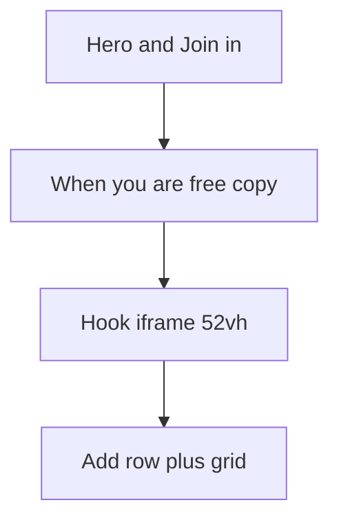

# Keep story order; compact the hook on small screens

Flipping the page (grid above the hook) is the wrong fix. The hero already says **read the player hook, mark when you can play**. Putting the grid first would bury the pitch and make “When you’re free” feel like a calendar app with flavor text tacked on.

The real issue is height, not order. In [`src/scheduler.jsx`](src/scheduler.jsx) the player hook iframe sits **above** the add-row form and AG Grid. In [`styles.css`](styles.css) that iframe is:

```751:758:styles.css
.player-hook {
  ...
  height: min(52vh, 480px);
}
```

On a phone, 52vh is roughly half the screen **after** the sticky header, hero, and “Mark times that work” copy. The grid never makes first paint.



## Recommended layout

**Desktop / tablet:** leave the current vertical order. Optionally later: two columns (hook | grid) if you want both in one glance; not required to fix phones.

**Small screens:** keep order, change how much of the hook is *open*.

1. **Default to a short teaser**, not a half-page iframe.
   - Cap collapsed height to something like `~160–200px` with a fade at the bottom.
   - Label: **Read the player hook** / **Show less**.
   - Expanded: allow a taller iframe (`min(70vh, 480px)` is fine once they asked for it).

2. **Jump link in the band copy** (cheap, helps even if they never expand).
   - In [`index.html`](index.html) under “Mark times that work”, add an in-page link to an id on the add-row / grid (e.g. `#mark-times`).
   - Same idea as “Join in” staying in the header: one tap past the story.

3. **Do not move “Join in.”** It is already sticky-adjacent in the hero. The missing piece is the **availability grid**, not signup.

4. **Do not invert for desktop.** A CSS `order` flip only on mobile still feels wrong if someone scrolls the page as a story. Collapse is clearer.

## What not to do

- Full-page sticky grid (fights reading the hook, messy with AG Grid + context menu).
- Cutting the hook to a one-line “Adventure Summary” link only — that link already exists; the iframe *is* the hook.

## Implementation sketch (when you want this built)

- Markup: wrap `.player-hook` in a details/summary or a small React toggle in [`src/scheduler.jsx`](src/scheduler.jsx); default **collapsed below ~860px** (match existing breakpoint in [`styles.css`](styles.css)).
- CSS: collapsed max-height + fade; expanded keeps current iframe behavior.
- Rebuild `grid/scheduler.js` via the existing Vite scheduler entry after JSX changes.
- Verify on a narrow viewport: first screen shows hero + times heading + teaser + **visible grid**; expanding the hook still scrolls naturally.

No backend changes. Admin summary URL / `/api/player-hook` stay as they are.
