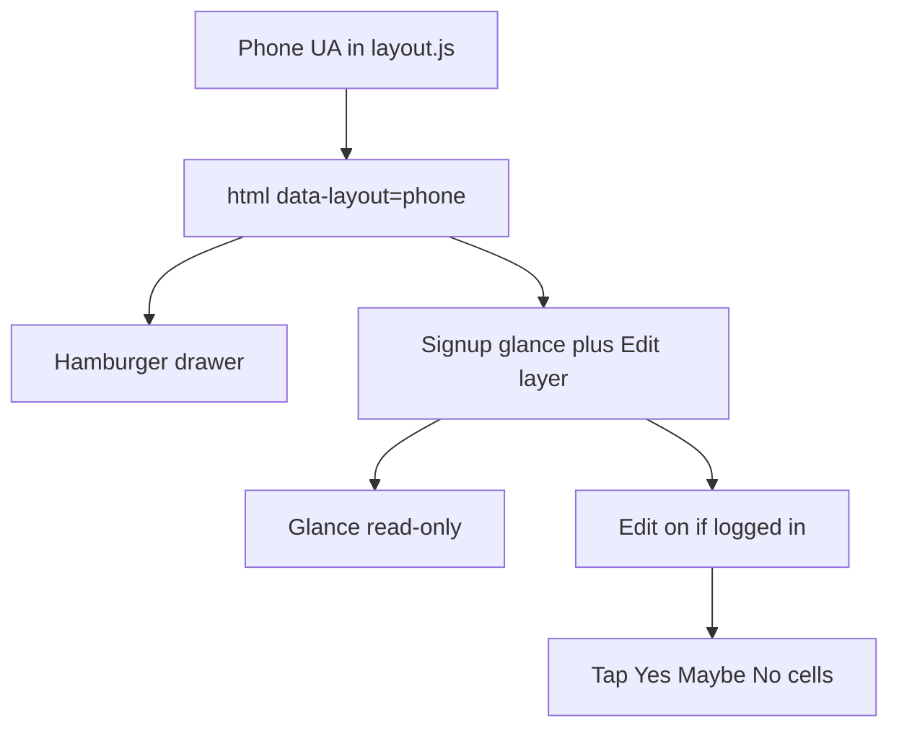

# Large screen first; phone signup second

**Never penalize a large-screen user.** Desktop / tablet / resized laptop is the canonical product: full header, glance **and** AG Grid, right-click, every control. Do not strip that with `max-width` media queries. Phone is an **additive** layout so people can actually **sign up** (join, pick times, vote). If they cannot complete that on a phone, the site missed the point.

Same URLs. A tiny script in `<head>` sets `html[data-layout="phone"]` from the **phone user-agent only**. Skinny desktop windows keep today’s AG Grid. iPad / Android tablets stay desktop unless the UA looks like a phone (`Mobile` + Android, iPhone, iPod).

No second HTML file, no redirect, no “responsive” downgrade of the grid for large screens.

## Signup (the important change)

Desktop stays: glance table (read-only snapshot) + AG Grid + right-click.

Phone layout ([index.html](index.html) + [src/scheduler.jsx](src/scheduler.jsx)):

- **Do not mount / hide AG Grid** (`#times` copy that talks about clicking the grid; hide `.scheduler-grid`).
- **The glance table is the schedule.** Same `#schedule-status` portal, restyled for phone (`[data-layout="phone"] .status-table`): larger row labels, Yes/Maybe/No as three tappable columns with avatars.
- **Edit layer (logged in only):** an **Edit** / **Done** control on the “Schedule at a glance” band (not per-row date editing).
  - Edit **off**: table is read-only. Taps do nothing.
  - Edit **on**: tapping a Yes / Maybe / No cell for a row calls existing `vote(timeId, status, mine)` so you change **your** choice. Highlight the column that is currently `mine`.
  - Logged out: no Edit button; Join in / login remains the path.
- **Add a time:** keep the add-row form (stacked). Jump link `#times` still points there. Hide or shorten the “click Yes Maybe No on the grid” blurb on phone.
- **Row owner actions** (calendar / edit date / delete): not via context menu. In Edit mode, rows you created (`createdByMe`) get a small overflow or “Manage” that reuses the existing edit modal + delete + calendar helpers.

PCs glance table stays read-only; only the schedule glance gets the Edit layer.

## Site chrome (phone layout only)

- [header.js](header.js): hamburger + drawer when `data-layout="phone"` (not `max-width: 860px`, so desktop resize does not switch nav).
- [styles.css](styles.css): **new** interactive rules go under `[data-layout="phone"]` only. Do not add 860px rules that hide the grid, collapse the 9-link nav, or remove desktop controls. Existing 860px stacking for forms/docs can stay; it must not change signup interaction on desktop.

## Detection ([layout.js](layout.js), new)

- Run first in every page `<head>` (and hook preview if needed).
- Match: iPhone / iPod; Android **phone** (`Android` + `Mobile`, exclude tablets).
- Optional `?layout=phone` / `?layout=desktop` for QA without spoofing UA.
- `document.documentElement.dataset.layout = "phone" | "desktop"`.
- Scheduler reads `document.documentElement.dataset.layout === "phone"` (and a `matchMedia` is **not** used to drop the grid).

## Admin + shared polish (phone layout)

- Stack `.email-row` / `.promote-post-row`; `.email-list` must not clip.
- Wrap `.form-actions` and `.admin-tabs`.
- Larger `.player-hook-toggle`, `.file-remove`, `.modal-close`, `.admin-gate`.
- Modal `100dvh` + safe-area.

## Verify

Spoof iPhone UA or `?layout=phone`. Confirm desktop UA + narrow window still shows AG Grid. Phone: glance read-only, Edit then vote, add-row, manage own rows, drawer nav on other pages.

## Out of scope

- Changing or simplifying desktop AG Grid / context menu / nav.
- Using viewport width to switch layouts.
- Separate `mobile.html` or server-side UA redirect.
- Discord widget internals.
