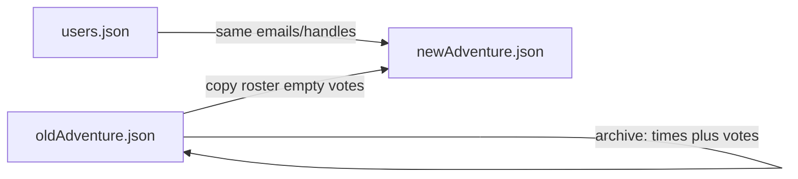

# Module switch: new id, copy roster, empty schedule

## What is already true

- **Accounts are global.** [data/runtime/users.json](data/runtime/users.json) is email + handle. Switching modules does not require re-login.
- **The table is per adventure file.** Votes, session rows (`times`), WG sheets, and promote live on `data/runtime/adventures/<id>.json`. `site.json` only points at which file is live (`defaultSessionId`).
- **Module pick is not live yet.** [listAmbaModules()](server.js) is locked to one provision. Comments say AMBA list-modules comes later.
- **User JSON restore** matches adventure `id` first, then title, then “only one live file.” Display uses `adventureTitle` (e.g. Palakar). The filesystem id underneath is what restore actually keys on.

## The two real cases

**Same sit-down, swap the packet** (uncommon): same people, same dates, they just want a different AMBA module/hook. In-place update of `title`, `ambaModuleId`, hook URLs on the existing file is enough. Same id. User backups still restore.

**We decided to play something else** (the case you described): that is a **new run**. Dates usually change. Old yes/maybe/no was for old slots. Saving under a new id is right.

## Recommendation

Default the second case:

1. Write a **new** adventure JSON (`emptyAdventure(newId)`), fill title/hook/`ambaModuleId` from the newly selected AMBA module.
2. Point `site.json` at the new id.
3. **Copy roster only:** signup rows with email/handle/discord/timezone/role, `votes: {}`, `voteNotes: {}`. Do not copy `times`.
4. **Leave the old file on disk.** Admin backups and user-nodes that still name Palakar restore into that archive by `id`, not onto the new module.
5. Do **not** auto-copy WG sheet packs or promote posts (those are module-specific). People still have accounts and can re-attach sheets.

Do not keep votes across a module change. Slot ids would not exist on a new schedule, and “yes to Thursday Palakar” is not “yes to next month’s other adventure.”

Optional later: an admin checkbox **Keep these session rows and votes** for the rare same-calendar swap. Do not make that the default.

## User export after a switch

- A node downloaded **before** the switch still has the old adventure `id` plus Palakar as `adventureTitle`. Restore merges into the **old file** if it still exists. That is correct.
- A node downloaded **after** the switch is for the new title/id.
- If the old file was deleted and only one adventure remains, restore currently falls back to that single file. Only then could old Palakar votes land on the new module. Keep the archive file (or drop the single-file fallback later).

## What not to do now

Do not build AMBA list-modules switching in this pass unless you want that UI next. The rule above is the contract for when that picker exists: **new provision + roster copy**, not retitle-in-place as the default.
