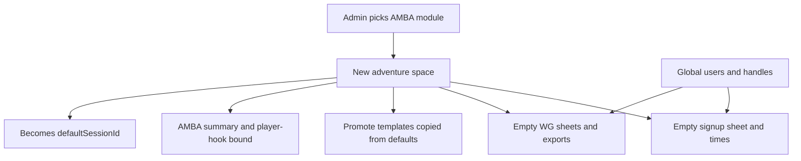

# Provisioned site per adventure

## Player-facing

There is **no public adventure picker**. `/` always loads **`defaultSessionId`** (today: Palakar / `amba-workflow-test-1`). It should feel like *this* table’s signup site: hook, schedule, Join in, WG characters, promote-driven copy.

**Switching is admin-only.** A **module dropdown** on [`admin.html`](admin.html) will later pick an AMBA module and **provision a fresh space**. This pass: dropdown **disabled**, locked to Palakar.

## Provisioning (mental model)

Loading a new adventure is like spinning up a new mini-site bound to that AMBA module:

Until the dropdown is enabled, Palakar is the only provisioned space. Data still gets **session-scoped** so the next module does not inherit Palakar’s list, votes, PCs, or LFG posts.

## Shared vs per adventure

**Global (same person everywhere)**

- Email login
- **Handle** (and user id)
- Timezone / Discord on the user record (profile, not table-specific)

**Per adventure (isolated space)**

- Session record: title, times, AMBA URLs + scraped hook, scope/format/targetPlayers, `ambaModuleId`
- Signup sheet: votes / availability (`signups` keyed by `sessionId` + email)
- Character status for this table
- WG public sheet links
- WG JSON exports (index + files under that session)
- Promote: templates, settings, posts (yes-emails follow this session’s votes)
- Reserved `adminPasswordHash` (null; one `ADMIN_PASSWORD` still rules all)

Handles never fork. The same email on a new adventure starts with **empty** votes and **empty** WG slots; they do not carry Palakar PCs onto the next table.

## Data layout

- [`data/site.json`](data/site.json) (new): `{ "defaultSessionId": "amba-workflow-test-1" }`
- [`data/sessions.json`](data/sessions.json): one object per adventure
- [`data/signups.json`](data/signups.json): add `sessionId`; backfill existing rows to Palakar
- [`data/users.json`](data/users.json): keep `handle` / email; **move `wgSheets` off the user** onto a session-scoped store (e.g. `data/wg-sheets.json` rows `{ sessionId, email, sheets }` or sheets nested on the session). Migrate current sheets to Palakar.
- WG exports: key [`wg-exports-index.json`](data/wg-exports-index.json) (and file paths) by `sessionId`; migrate existing files to Palakar
- Promote: either `promote.json` as `{ [sessionId]: { templates, settings, posts } }` or `data/promote/<sessionId>.json`. Seed Palakar with today’s [`data/promote.json`](data/promote.json). New adventures get a **copy of default templates**, empty posts, empty webhook unless you later copy settings on purpose.

## Server

Public APIs use **`defaultSessionId` only** (no `?id=` on the homepage).

- `/api/state`, times, slot, player-hook, WG sheets, WG exports: filter/write for the default session
- `/api/login` / `/api/signup`: still upsert the **global** user; do not copy WG or votes from other sessions
- `GET /api/admin/amba-modules`: stub, one locked Palakar option; comment the real AMBA list-modules fetch
- Later (not this pass): selecting a module **creates** a session if needed, empty signups/WG/promote clone, binds syndication/player-hook, sets `defaultSessionId`. Public site immediately shows that new empty signup sheet with the new hook.

## Admin UI

- **Adventure** `<select disabled>` above the AMBA URL fields; one selected option
- Helper: each module gets its own signup, characters, and promote; switcher comes from AMBA later
- Yes-emails and Promote tab already operate on the active session; they stay that way once data is scoped

## Out of scope this pass

- Enabling the dropdown / live AMBA module list / actual provision-on-select
- Public hub
- Per-adventure admin passwords (field only)
- Per-adventure Discord guild (still one Discord widget unless you ask later)
